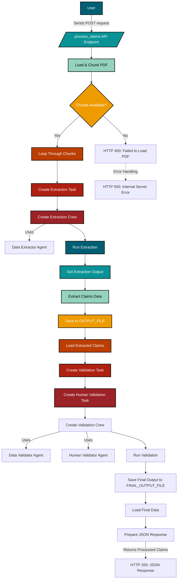

# Multi-Agent Data Extraction & Validation System

This project implements a Multi-Agent Data Extraction Validation System  using FastAPI,CrewAI & Gemini Flash 2 to extract and validate data from PDF documents. It leverages Google's Gemini models for text extraction and validation.

## Table of Contents

1.  [Project Architecture](#project-architecture)
2.  [Prerequisites](#prerequisites)
3.  [Setup and Installation](#setup-and-installation)
4.  [Configuration](#configuration)
5.  [Running the API](#running-the-api)
6.  [API Endpoint](#api-endpoint)
7.  [File Structure](#file-structure)
8.  [Explanation of Files](#explanation-of-files)
9.  [Error Handling](#error-handling)
10. [Example Usage](#example-usage)
11. [License](#license)

## Project Architecture




## Prerequisites
Before you begin, ensure you have the following:

- Python 3.8+ installed.
- pip package manager.
- A Google Cloud Project with the Gemini API enabled.
- A Gemini API Key.

## Setup and Installation
Clone the repository:

```bash
git clone <repository_url>
cd <repository_directory>
```

Create a virtual environment (recommended):

```bash
python -m venv venv
source venv/bin/activate  # On Linux/macOS
venv\Scripts\activate  # On Windows
```

Install the required packages:

```bash
pip install -r requirements.txt
```

## Configuration
Set the Gemini API Key:

- Create a `.env` file in the project's root directory.
- Add your Gemini API key to the `.env` file:

```env
GEMINI_API_KEY=<your_gemini_api_key>
```

### PDF File Path
The default PDF file path is set in `config.py`:

```python
# config.py
PDF_FILE_PATH = "LossRun.pdf"
```

Place your PDF file in the project's root directory (or update the path accordingly in `config.py`). Ensure the PDF's layout matches the prompts' expectations.

## Running the API
Start the FastAPI server:

```bash
uvicorn api:app --reload
```

This command starts the server with hot reloading enabled, so changes to the code will automatically restart the server.

## API Endpoint

- **Endpoint:** `POST /process/`
- **Request Body:** None (the API processes a pre-defined PDF file).
- **Response Body:** A JSON object containing the extracted claims and human validation results.

## File Structure

```
.
├── agents/
│   ├── data_extractor.py    # Defines the Data Extractor Agent.
│   ├── data_validator.py      # Defines the Data Validator Agent.
│   └── human_validation_agent.py     # Defines the Human Validation Agent.
├── config.py                # Configuration settings (API key, PDF path, etc.).
├── api.py                   # FastAPI application for claim processing.
├── models/
│   ├── claim_details.py      # Pydantic model for claim details.
│   └── human_validation.py # Pydantic model for human validation data.
├── prompts/
│   ├── extraction_prompt.py   # Prompt for the extraction phase.
│   ├── human_validation_prompt.py  # Prompt for the human validation phase.
│   └── validation_prompt.py     # Prompt for the validation phase.
├── tasks/
│   ├── extraction_task.py     # Defines the extraction task.
│   ├── human_validation_task.py # Defines the human validation task.
│   └── validation_task.py       # Defines the validation task.
├── tools/
│   └── pdf_loader.py          # Loads and chunks the PDF document.
└── utils/
    └── all_utils.py    # Utility functions.
├── requirements.txt         # Project dependencies.
└── README.md                # This file.
```

## Error Handling
The API includes comprehensive error handling:

- **Pydantic Validation Errors:** Catches and reports Pydantic validation errors with a `400` status code, providing detailed information about the validation failures.
- **HTTPExceptions:** Re-raises any existing `HTTPException`s to preserve their original status code and context.
- **Unexpected Errors:** Catches other unexpected errors with a `500` status code, providing a generic error message.

## Example Usage

Start the API server:

```bash
uvicorn api:app --reload
```

Send a `POST` request to the `/process_claims/` endpoint:

You can use `curl`, Postman, or any other HTTP client to send the request. Since this API processes a pre-defined PDF file, you don't need to include any data in the request body.

```bash
curl -X POST http://localhost:8000/process
```

The API will return a JSON response containing the extracted claims and human validation results.

## License
**MIT License**